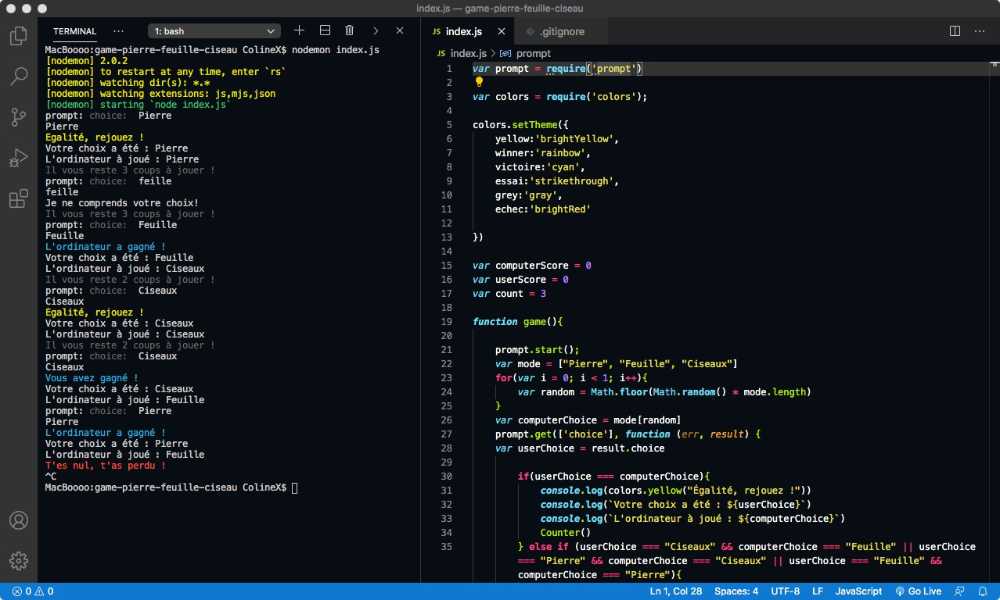
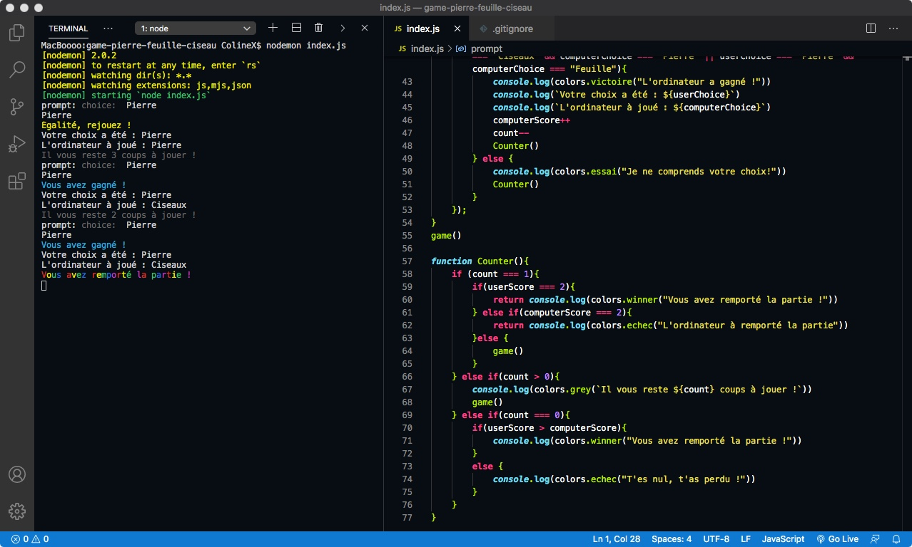

<h1> Jeu de pierre/feuille/ciseaux contre l’ordinateur. </h1>

• Pour jouer, ouvrir la console de l'ordinateur :  
Installer les node_modules > npm install  
Passer la commande > nodemon index.js

• Le jeu se déroule en trois manches :  
Pour gagner il faut remporter 2 manches, le jeu s'arrête avant le 3e tour si c'est le cas.  
En cas d'égalité le score n'est pas comptabilisé il faut rejouer.

A chaque manche écrire en toutes lettres "Pierre" "Feuille" ou "Ciseaux" dans la console.  
Attention aux fautes, sinon l'ordinateur ne comprend pas le choix…

